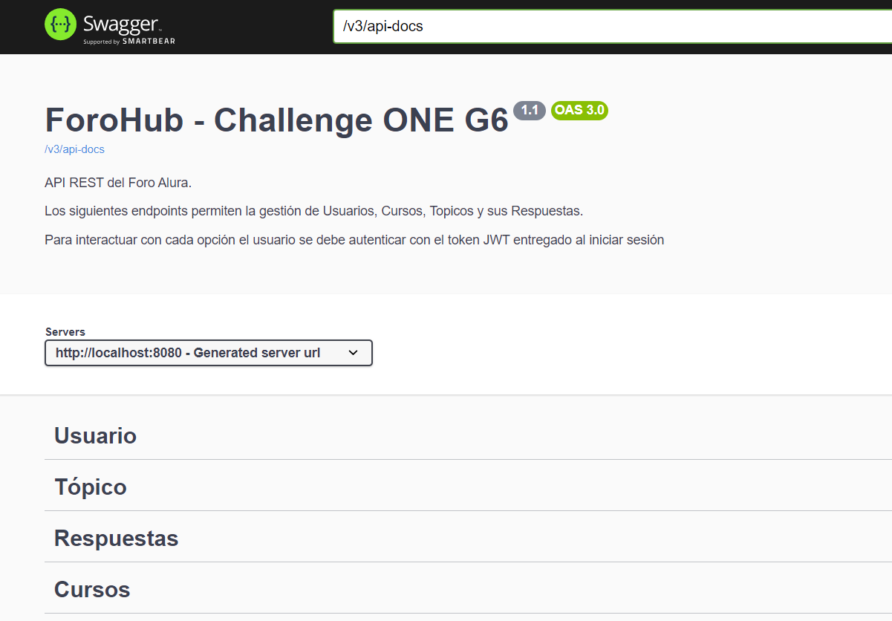
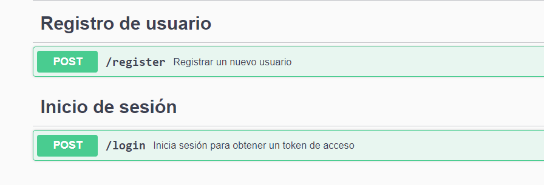
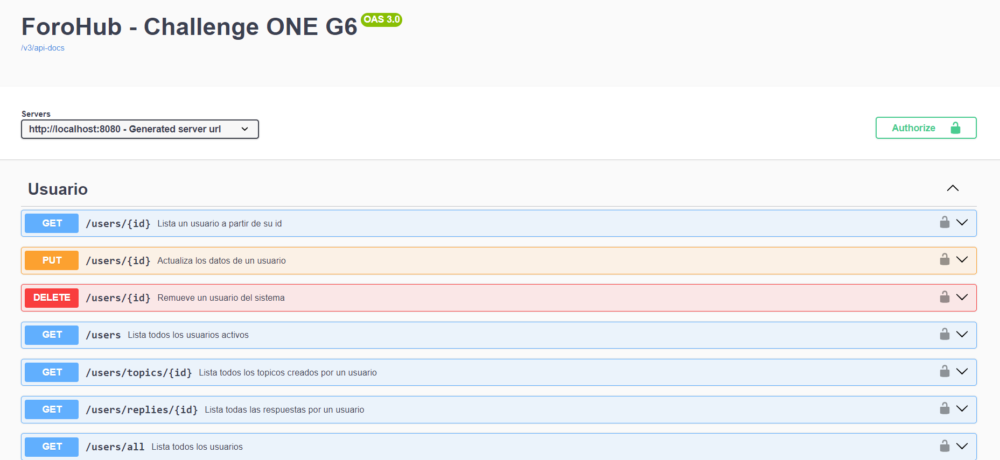
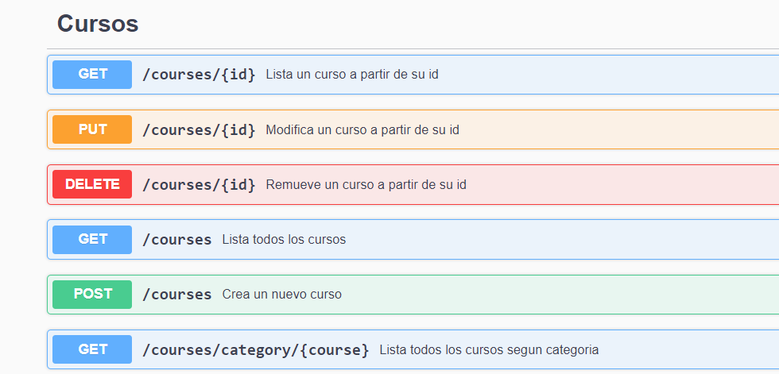
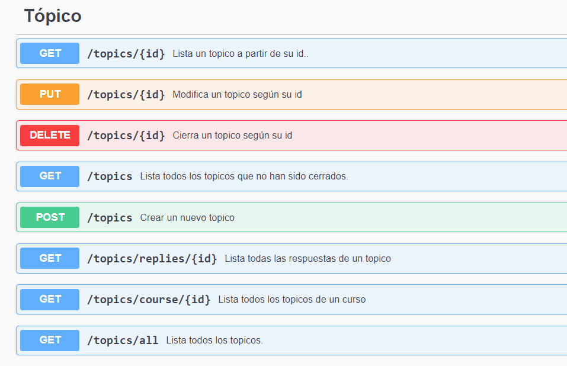
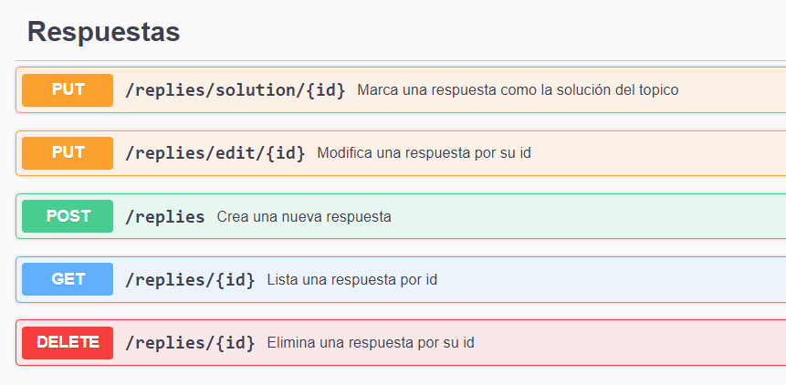

<h1 align="center"> Challenge ForoHub</h1>

Este proyecto consiste en una API REST del backend de un foro implementado en Java con Spring Boot, y es mi solución al desafío propuesto por el bootcamp Oracle Next Education impartido por Alura Latam en su formación de desarrollo back-end.

---
## Características del sistema
* API documentada en Swagger, donde se pueden testear sus funcionalidades.
* Operaciones bloqueadas; para operar los endpoints, el usuario se debe autenticar con el token JWT que se entrega al iniciar sesión.
* Gestión de Usuarios, Cursos, Tópicos y sus Respuestas.
* Multitud de opciones de listado.
---

## Tecnologías
* Spring Boot
* Spring Data JPA
* Spring Security
* JWT
* Hibernate
* MySQL
* Postman
* Swagger
---

## Endpoints

    

---

### Registro e Inicio de Sesión

    

---

### Usuario

    

---

### Curso

    

---

### Tópico

    

---

### Respuestas

    

---

